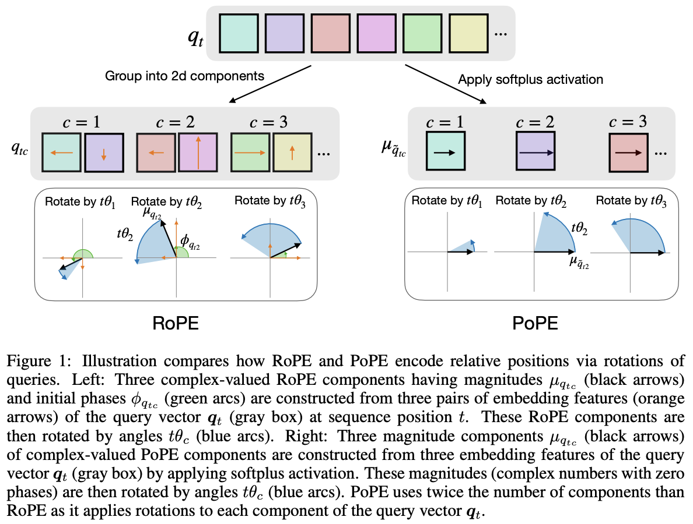

</img>

## PoPE-pytorch

Efficient implementation (and explorations) into [polar coordinate positional embedding (PoPE)](https://arxiv.org/abs/2509.10534) - from [Gopalakrishnan](https://agopal42.github.io/) et al. under Schmidhuber

## Install

```shell
$ pip install PoPE-pytorch
```

## Usage

```python
import torch
from PoPE_pytorch import PoPE

# define pope

pope = PoPE(64, heads = 8)

# pass in sequence length

pos_emb = pope(1024)

# queries and keys in attention

q = torch.randn(1, 8, 1024, 64)
k = torch.randn(1, 8, 1024, 64)

# training

rotated_q, rotated_k = pope.apply_pope_to_qk(pos_emb, q, k)

# inference

rotated_q, rotated_k = pope.apply_pope_to_qk(pos_emb, q[..., -1:, :], k)
```

### Axial PoPE 

For images, video, etc. where multiple dimensions are needed, you can use `AxialPoPE`. The feature dimension will be split across these axial dimensions.

You can either pass in the positions manually, or just pass the dimensions as a `tuple`, in which case the grid positions will be automatically generated.

```python
import torch
from PoPE_pytorch import AxialPoPE

# axial pope for images (e.g. 32x32)
# split 64 dim into 32 (x) and 32 (y)

pope = AxialPoPE(
    dim = 64,
    heads = 8,
    axial_dims = (32, 32)
)

pos_emb = pope((32, 32)) # (1024, 64) frequencies

# for video (e.g. 8 frames, 16x16 frames)
# split 96 dim into 32 (t), 32 (x), 32 (y)

pope_video = AxialPoPE(
    dim = 96,
    heads = 8,
    axial_dims = (32, 32, 32)
)

pos_emb_video = pope_video((8, 16, 16)) # (2048, 96) frequencies

# queries and keys
# then apply to q, k as usual

q = torch.randn(1, 8, 2048, 96)
k = torch.randn(1, 8, 2048, 96)

rotated_q, rotated_k = AxialPoPE.apply_pope_to_qk(pos_emb_video, q, k)
```

### Fused Attention Similarity

```python
import torch
from PoPE_pytorch import PoPE, compute_attn_similarity

# define pope

pope = PoPE(dim = 64, heads = 8).cuda()

# get rotations

pos_emb = pope(1024)

# queries and keys

q = torch.randn(1, 8, 1024, 64).cuda()
k = torch.randn(1, 8, 1024, 64).cuda()

# fused attention similarity, avoiding expanding 64 to 128

sim = compute_attn_similarity(q, k, pos_emb) # (1, 8, 1024, 1024)

attn = sim.softmax(dim = -1) # the usual in attention..
```

### Fused Flash Attention

```python
import torch
from PoPE_pytorch import PoPE, flash_attn_with_pope

# pope

pope = PoPE(dim = 32, heads = 8).cuda()

# queries, keys, values for attention

q = torch.randn(2, 8, 1024, 64).cuda()
k = torch.randn(2, 8, 1024, 64).cuda()
v = torch.randn(2, 8, 1024, 64).cuda()

pos_emb = pope(1024)

mask = torch.ones((2, 1024)).bool().cuda()

out = flash_attn_with_pope(q, k, v, pos_emb = pos_emb, causal = True, mask = mask)

assert out.shape == (2, 8, 1024, 64)
```

## Citations

```bibtex
@misc{gopalakrishnan2025decouplingwhatwherepolar,
    title   = {Decoupling the "What" and "Where" With Polar Coordinate Positional Embeddings}, 
    author  = {Anand Gopalakrishnan and Robert Csordás and Jürgen Schmidhuber and Michael C. Mozer},
    year    = {2025},
    eprint  = {2509.10534},
    archivePrefix = {arXiv},
    primaryClass = {cs.LG},
    url     = {https://arxiv.org/abs/2509.10534}, 
}
```
